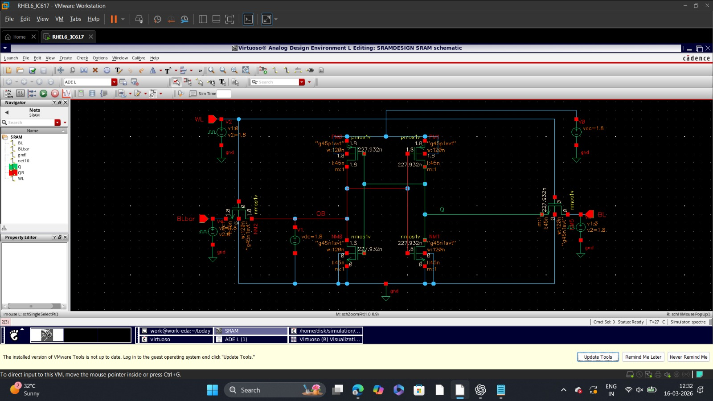
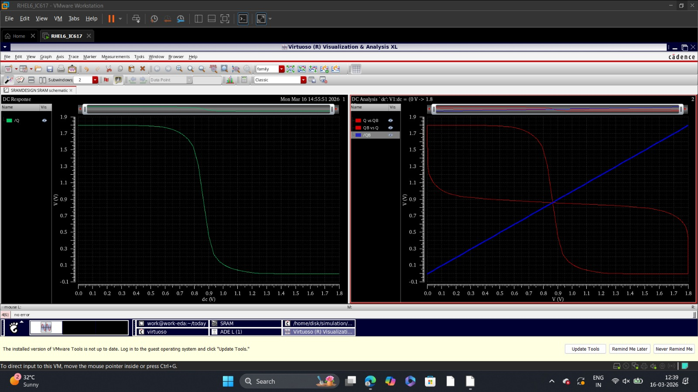

# 🧠 Design and Simulation of a 6-Transistor SRAM Cell for Low-Power VLSI Applications

## 📌 Project Overview

**SRAM (Static Random-Access Memory)** is a type of volatile memory that retains data as long as power is supplied. It is one of the most fundamental building blocks in modern VLSI systems — used in **cache memory (L1/L2), embedded processors, and System-on-Chip (SoC)** designs.

This project focuses on the **6-Transistor (6T) SRAM cell** — the most widely used and compact SRAM architecture. The cell was designed, simulated, and analyzed at the **45 nm CMOS technology node** using **Cadence Virtuoso**, with the primary goal of achieving **low power consumption and high stability**.

---

## 🔁 Read & Write Operations

### ✍️ Write '0'
 WL = HIGH → M5, M6 turn ON
 BL = 0V, BL' = VDD
 Node Q pulled to 0, QB pulled to VDD
 **Cell stores: Q = 0, QB = 1**

### ✍️ Write '1'
 WL = HIGH → M5, M6 turn ON
 BL = VDD, BL' = 0V
 Node Q pulled to VDD, QB pulled to 0
 **Cell stores: Q = 1, QB = 0**

### 📖 Read '0'
 WL = HIGH, BL and BL' pre-charged to VDD
 Q = 0 → discharges BL slightly (small ΔV)
 Sense Amplifier detects ΔV → reads **'0'**

### 📖 Read '1'
 WL = HIGH, BL and BL' pre-charged to VDD
 QB = 0 → discharges BL' slightly (small ΔV)
 Sense Amplifier detects ΔV on BL' → reads **'1'**

---

## 🖼️ Simulation Results

### 📐 Circuit Diagram
> Standard 6T SRAM circuit with cross-coupled inverters and access transistors.

---

### 🔬 Cadence Schematic (45 nm)
> Schematic drawn and verified in Cadence Virtuoso using 45 nm PDK.

---

### 📊 DC Response
> Voltage Transfer Characteristics (VTC) confirming two stable states and correct trip point.

---

### 📈 Transient Response
> Time-domain waveforms showing correct switching behavior of Q and QB nodes.

---

### ✍️ Write '0' Operation
> WL HIGH, BL = 0V, BL' = VDD → Q successfully written to 0.

---

### ✍️ Write '1' Operation
> WL HIGH, BL = VDD, BL' = 0V → Q successfully written to 1.

---

### 📖 Read '0' Operation
> WL HIGH, Q = 0 → BL discharges, sense amplifier reads 0 correctly.

---

### 📖 Read '1' Operation
> WL HIGH, QB = 0 → BL' discharges, sense amplifier reads 1 correctly.

---

## 🛠️ Tools & Technology

| Parameter | Details |
|-----------|---------|
| **Technology Node** | 45 nm CMOS |
| **EDA Tool** | Cadence Virtuoso |
| **Simulator** | Spectre (via ADE) |
| **Analysis Types** | DC Analysis, Transient Analysis |
| **Supply Voltage** | 1.0 V / 0.9 V |
| **Parasitic Extraction** | Cadence QRC / PEX |

---

## 📉 How Power & Delay Were Reduced

### Power Reduction
$$P_{dynamic} = \alpha \cdot C_{load} \cdot V_{DD}^2 \cdot f$$

 🔹 **Minimized WL pulse width** → reduced switching activity (α ↓)
 🔹 **Partial bitline swing** → BL never fully discharges → less charge movement
 🔹 **Smaller transistor W** where full drive strength not needed → C ↓

### Delay Reduction
$$t_{delay} = \frac{C \cdot \Delta V}{I_{drive}}$$

 🔹 **Higher W/L for drive transistors** → higher ID → faster node discharge
 🔹 **Compact layout** → shorter wire lengths → lower parasitic capacitance
 🔹 **Post-layout simulation** with extracted parasitics to verify real-world performance

---

## 📬 Contact

If you have any questions, suggestions, or need help understanding this project — feel free to reach out!

 🐙 **GitHub:** [@Vasantha-priyan](https://github.com/Vasantha-priyan)
 **Portfolio:** [Portfolio](https://vasanthapriyan-dev.web.app/)
 📩 **Open an Issue:** [Click here](../../issues)

> 💡 Feel free to fork this repository, explore the simulations, and build on top of this work!

---

**⭐ If you found this project helpful, please consider giving it a star!**

